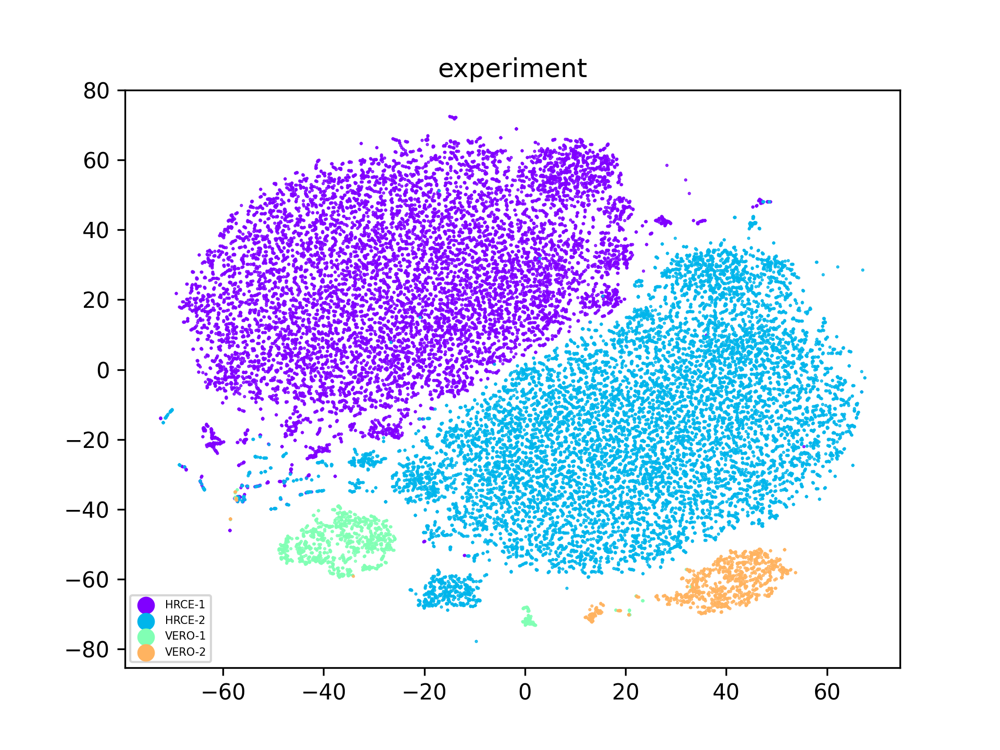
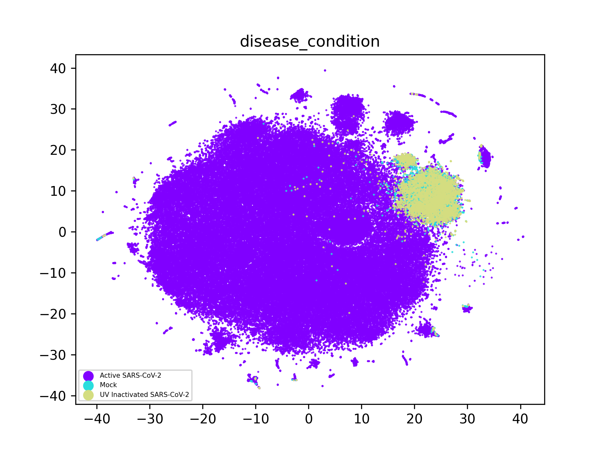

# RxRx19-analysis

This is a brief exploratory analysis of the [RxRx19 dataset released by Recursion Pharma.](https://www.rxrx.ai/rxrx19a) I've been meaning to dig into this for months, and I am already impressed!

In summary, Recursion has treated cells with drugs, and then infected them with COVID19. Afterwards, high-resolution microscopic imagery is performed on multiple flourescent channels that target distinct cellular structures. Following this, a deep learning model condenses this large image dataset into embedded vectors of 1024 dimensions that describe each image.

I have no idea how their deep learning model is trained, but it is effectively a black box that reduces the dimensionality of the image. The cellular images aren't completely representative of the underlying cell state, which itself is a black box. Somewhere in this stack is the real cellular state (s), hidden from us.

s -> [black box inner workings of the cell] -> [visual appearance] -> [recursions model] -> e

With these embedding vectors, we have a birds-eye view that only partially reveals the cells underlying state, but its still useful! Its also much cheaper than more direct measurements, such as single-cell sequencing to determine gene expression levels. 

For drug repurposing, it is useful to consider the idea that the underlying cell state is perturbed by that drug. Furthermore, insults such as viral infection will also perturb this state. Some of that perturbation will hopefully be projected through this stack of black boxes to be optically detected with the handful of dyes used! To find drugs for COVID19, what we need to define is some kind of baseline homeostatis of the cells. Later, if we find drugs that return infected cells to that homeostasis, they may be viable candidates.

## Preliminary exploration

First, a breakdown of the condition of each well shows a justifiably unbalanced dataset. Still, quite a lot of controls!

	Active SARS-CoV-2            280376
	Mock                           9120
	UV Inactivated SARS-CoV-2      9120

There are two cell types, split into 4 distinct experiments

	========== cell_type === unique values :  2
	HRCE    284080
	VERO     21440
	========== experiment === unique values :  4
	HRCE-2    144720
	HRCE-1    139360
	VERO-1     10720
	VERO-2     10720

## Visualization

Ive been looking for an excuse to play with tSNE embedding! For this dataset, it seems to have worked wonders! I start with plots on 5% of the full shuffled dataset. The most important, and enthusiastic finding, is that the embedding vectors for the Mock and UV-inactivated cells tend to form significant clusters, suggesting that this homeostasis appears to be relatively stable from the perspective of the microscopy images.

|              |   |
:-------------------------:|:-------------------------:
 |  

Despite this, the embedding vectors form distinct clusters that correspond to both cell-type, and the experiment performed. By far most of the data are from the two HRCE experiments, each of which has its own associated cluster. Within each of these experiments is a local cluster of cells in homeostasis. This is important, because the tSNE embedding has revealed that there is a systematic bias in those image datasets that propagated through the nearal network and created a euclidean separation of the corresponding embedding vectors.

What could have caused this bias? Many things! Experiments run on different days, difference in microscope aquisition settings, a slightly different concentration of one of the channel dies, or many other factors. Regardless of the cause, the embedding vectors are slightly shifted in their 1024-D vector space on all images from a specific experiment. 

This transformation can be easily corrected however! We can just compute centroid vectors for each of the 4 experiments, and then subtract this centroid from each vector in turn. Doing so centers the dataset. Running the tSNE again reveals that the clusters for the same cell type collapse!  

|              |   |
:-------------------------:|:-------------------------:
 |  

### exploring other biases

The following are results from an overnight tSNE run on the **entire** dataset, without normalizing by experiment. With a larger number of points, it is possible to see other categorical variables that are somehow distinguishable by the neural network. The plate number for example shows quite clearly that all Vero samples were collected on just a few plates. More intriguingly, the site imaged within each well shows an obvious clumpiness, which implies that **the deep learning model is able to distinguish which of the 4 corners it is imaging.** I'll need to look at the image dataset later to learn why! 

Importantly, these other confounds are just as easily normalized as the experimental run. For each plate or site, centroids can be subtracted.

|              |   |
:-------------------------:|:-------------------------:
  |  
  |  

### Focusing on one experiment

# Install notes

install cudatsne for faster tSNE computations on the GPU

this took way too much time ..... using ubuntu 20 might be easier ....

	* compile and install cmake : https://askubuntu.com/questions/355565/how-do-i-install-the-latest-version-of-cmake-from-the-command-line
	* install cuda-10-2
	* install intel MKL
	* clone faiss repo, compile, install : https://github.com/facebookresearch/faiss/blob/master/INSTALL.md
		* need to manually edit makefiles to point to intel MKL, python libs, etc ..... 
	* pip3.6 install faiss-gpu
	* pip3.6 install tsnecuda 

