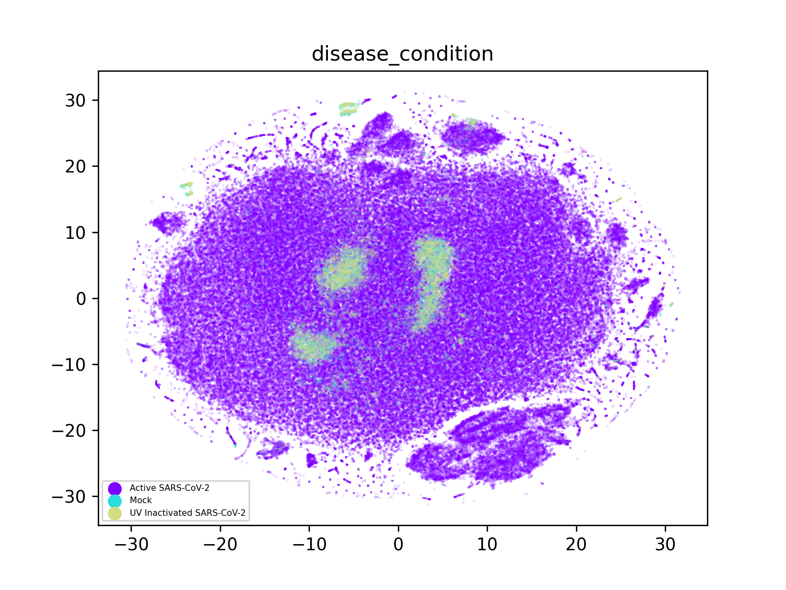
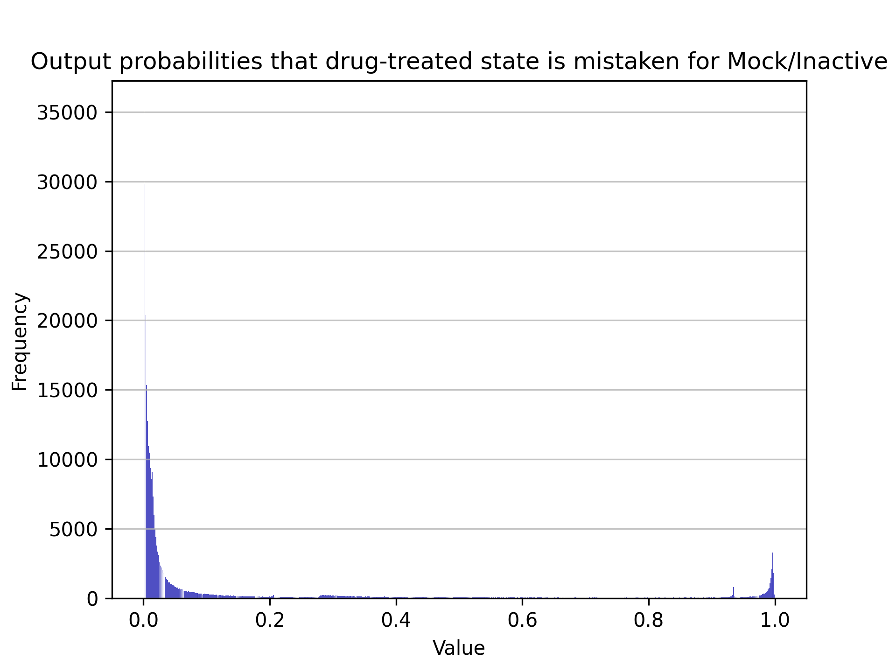

# RxRx19-analysis

# Intro to the problem

This is a brief exploratory analysis of the [RxRx19 dataset released by Recursion Pharma.](https://www.rxrx.ai/rxrx19a) I've been meaning to dig into this data for months, and now I have an excuse!

In summary, Recursion has treated cells with drugs, and then infected them with COVID19. Afterwards, high-resolution microscopic imagery is performed on multiple flourescent channels that target distinct cellular structures. Following this, a deep learning model condenses this large image dataset into embedded vectors of 1024 dimensions that describe each image.

I have no idea how their deep learning model is trained, but it is effectively a black box that reduces the dimensionality of the image. The cellular images aren't completely representative of the underlying cell state, which itself is a black box. Somewhere in this stack is the real cellular state (s), hidden from us underneath multiple layers.

biological state -> [cellular black box] -> visual appearance -> [just 5 dyes] -> [recursions black box] -> embedding 

With these embedding vectors, we have a birds-eye view that only partially reveals the cells underlying state, but its still useful! Its also much cheaper than more direct measurements, such as single-cell sequencing to determine gene expression levels. 

For drug repurposing, its useful to consider that both disease insults (like covid infection) and drug exposure will perturb the underlying cellular state, and hopefully shift the images enough to show a clear perturbation in the embedding space. To find drugs for COVID19, what we need to define is some kind of "baseline homeostatis" of the cells. Later, if we find drugs that return infected cells to that homeostasis, they may be viable candidates.

## Preliminary exploration

First, a breakdown of the condition of each well shows a justifiably unbalanced dataset. Still, quite a lot of controls!

	Active SARS-CoV-2            280376
	Mock                           9120
	UV Inactivated SARS-CoV-2      9120

There are two cell types, split into 4 distinct experiments

	========== cell_type === unique values :  2
	HRCE    284080
	VERO     21440

	========== experiment === unique values :  4
	HRCE-2    144720
	HRCE-1    139360
	VERO-1     10720
	VERO-2     10720

## Visualization

I've been looking for more opportunities to play with tSNE embedding, and this problem lends itself to this technique. I start with plots on 5% of the full shuffled dataset. The most important, and enthusiastic finding, is that the embedding vectors for the Mock and UV-inactivated cells tend to form significant clusters, suggesting that this homeostasis appears to be relatively stable amongst many microscopy images.

|              |   |
:-------------------------:|:-------------------------:
 |  

The embedding vectors also form distinct clusters that correspond to both cell-type, and the experiment performed. By far most of the data are from the two HRCE experiments, each of which has its own associated cluster that is disjoint from the rest of the embedding space. The tSNE embedding has revealed that there is a systematic bias between experimental replicates.

What could have caused this bias? Many things! Experiments could have been run on different days, leading to differences in microscope aquisition settings, a slightly different concentration of one of the channel dies, or any other factors of prepping the samples. Regardless of the cause, the images from the experiments were ever-so-slightly different, and recursions deep learning model translated these differences into euclidean transformations in the embedding vector space. TSNE just made this shift easier to see.

This transformation can be easily corrected however! We can just compute centroid vectors for each of the 4 experiments, and then subtract this centroid from each vector in turn. Doing so centers the dataset. These vectors could also be normalized by their respective standard deviations.  Running the tSNE again reveals that the clusters for the same cell type collapse!  

|              |   |
:-------------------------:|:-------------------------:
 |  

### exploring other biases

The following are results from an overnight tSNE run on the **entire** dataset, (but without the previous normalization). With a larger number of points, it is possible to see other categorical variables that are somehow distinguishable by the neural network. The plate number for example shows quite clearly that all Vero samples were collected on just a few plates. More intriguingly, the site imaged within each well shows an obvious "clumpiness", which implies that the deep learning model is sometimes able to distinguish which of the 4 corners of a well it is imaging. I'll need to look at the image dataset later to learn why! I wonder if it can spot the walls!

These other confounds are just as easily normalized as the experimental run. For each plate or site, centroids can be subtracted. It could also be argued that the four sites of each well could have their embedding vectors averaged, but such a strategy is probably best assessed in a larger pipeline.

|              |   |
:-------------------------:|:-------------------------:
  |  
  |  

I mapped concentration too. Indeed a few clusters appear, specifically of higher-concentrations of drugs. I can imagine a few distinct causes of this. Large detoxification activity in the cells perhaps? Or even a direct photometric effect of certain drugs on the flourescence signals of a specific channel?

### A full overnight run, with all variables centered

Running tSNE on the full dataset takes many hours, so I committed to centering 4 of the categorical variables in the dataset. : ['experiment', 'site', 'plate', 'disease_condition']

Most relevantly, it became clear that centering on "disease condition" is likely required, because of how I assume the plates were prepared. Cells were most likely infected in batch, and then spread to each well. This batch may or may not have been prepared independently of each plate. 

Centering the embedding vectors results in multiple "homeostatic clusters" featured prominently in the center of the manifold. I find this encouraging, as this suggests that the cells can take on a number of normal states. Also encouraging is that the Mock and UV-inactivated preparations produce the same 3 overlapping clusters.

|              |   |
:-------------------------:|:-------------------------:
  |  
  |  

### Post-correction .... how can we find leads?

Taking a cue from the "connectivity map" project, and other similar drug repurposing efforts based on gene expression perturbations, drugs for a given illness could be found if they perturb a cellular state in a direction opposite that of the illness. In the embedding space, one could imagine finding vectors that are antipodal to the disease perturbations.

With this dataset however, what is missing is data on the cellular states induced by each drug applied to uninfected cells! While sufficient healthy control cells are present to obtain a nice homeostatic baseline, the rest of the data is some mixture of that drugs perturbation **and** the perturbation induced by the virus. This can confound our efforts.

Thus, it seems that a reasonable starting point for finding lead compounds is to look within the "neighborhood of homeostasis" in this unsupervised embedding. This is breaking a few rules! Indeed, euclidean distances are only reliable over short distances in such embeddings! Comparisons should also be performed for straight kNN in an embedding provided by PCA, or the full embedding dimension itself.

#### Finding potential drug hits

Using a simple nearest-neighbor approach, we can find points in these plots that neighbor the clusters of homeostatic cells. I implemented this search with a KDTree to find all points within a 0.05 radius in this manifold. The result finds drugs clustered around the core, in orange.

To rapidly summarize the top drugs, I merely counted the occurance of each by name. This will float the replicates to the top, as well as prioritize drugs that work at multiple concentrations. Excitingly, many of these drugs end in "vir"

     57 Migalastat
     54 solithromycin
     51 Polydatin
     50 Tenofovir Disoproxil Fumarate
     49 Ribavirin
     49 Aloxistatin
     48 Camostat
     47 Oseltamivir carboxylate
     46 Penciclovir
     46 Indinavir
     45 GS-441524
     44 Ritonavir
     43 Haloperidol
     43 Dimethyl fumarate
     42 Cobicistat
     42 Arbidol
     40 Thymoquinone
     40 quinine-ethyl-carbonate
     39 Darunavir
     37 Idelalisib
     36 ML-9
     35 Quinine
     35 Indomethacin
     34 Efonidipine
     33 Lafutidine
     33 Imiquimod
     33 Favipiravir
     32 Quercetin
     31 Remdesivir (GS-5734)
     31 Forodesine
     30 Triclocarban
     30 phenylpiracetam

# Trying a supervised approach

We can (ab)use a supervised machine learning approach. The basic idea here is to train a very simple neural network that classifies embedding vectors into two binary classes : 

	0 : Infected
	1 : Mock, or UV Inactivated

Whats important is to train the network to not memorize the training set. If generalization is achievable, then one can merely evaluate the embedding vectors associated with drug treatment to see which drugs result in the wrong classification. (label 1)

If you run the predictor on the drugs, you get a histogram showing a small fraction that are misclassified :

Taking the top 10k predictions, and counting by drug name, we get a similar list of hits enriched for antivirals.

 
    188 GS-441524
    169 Quinine hydrochloride
    164 Thymoquinone
    156 CAL-101
    155 methylprednisolone-sodium-succinate
    140 Chloroquine
    139 Pacritinib
    139 Hydroxychloroquine Sulfate
    133 Aloxistatin
    132 Ribavirin
    126 Tenofovir Disoproxil Fumarate
    125 1-deoxygalactonojirimycin
    124 solithromycin
    124 Remdesivir (GS-5734)
    124 Dimethyl fumarate
    118 Polydatin
    118 Penciclovir
    116 quinine-ethyl-carbonate
    114 Lopinavir
    114 Haloperidol
    112 Quinine
    112 Cobicistat
    110 Arbidol
    109 Imiquimod
    107 Favipiravir
    107 Darunavir
    103 oseltamivir-carboxylate
    103 Nicotianamine
    103 Indomethacin
     99 Camostat
     96 Indinavir
     95 Ritonavir
     51 Dasatinib
     35 proscillaridin-a
     30 mizolastine
     27 bupranolol
     26 digitoxin
     25 nifenalol
     22 piperaquine-phosphate
     21 Itraconazole
     20 salinomycin
     20 (+)-Ephedrine (hydrochloride)
     20 Ebastine
     19 Opicapone
     19 FG-4592
     19 Diiodohydroxyquinoline

# Best drug hits

Several compounds show up in the top-lists for both the unsupervised and supervised ML approaches

My favorite is GS-441524. This is the active metabolite of remdesivir.

Also found in both results is **camostat**. This is a protease inhibitor for the TMPRSS2 enzyme required for Sars-CoV-2 entry into cells.

Thymoquinone, is a notable PAINS member, so we can probably ignore it. Lets not talk about the hydroxychloroquine hit :) 

[Aloxistatin](https://en.wikipedia.org/wiki/Aloxistatin) has already been demonstrated to [inhibit coronavirus protein and RNA processing](https://www.sciencedirect.com/science/article/pii/S0042682285711233?via%3Dihub)

# Install & Usage notes

create virtualenv and install packages

	python3 -m venv venv
	source venv/bin/activate
	pip3 install -r requirements.txt

After this, place symlinks to the large embeddings.csv and metadata.csv files in your local work directory

	ln -s /path/to/embeddings.csv ./ 
	ln -s /path/to/metadata.csv ./ 

Run loadData.py to parse the large embeddings.csv file and create an "embeddings.hdf" file. This loads significantly faster for the next step.

	python3 loadData.py -convert embeddings.csv

Next, to run tSNE, call the following utility. Note that the -fraction option is used to limit the amount of data the computations are performed on. (for testing) By default, its 5%, which takes ~5 minutes. The full dataset takes many hours to compute.

	python3 tsne.py -fraction 0.05

This will produce a tSNE.hdf file. This is a binary pandas dataframe containing the tSNE embedding coordinates, along with the joined metadata.

The next script will load this file and plot this embedding space, and then perform a nearest-neighbor search for drug-treatment conditions that fall within a specific radius of cells in the non-infected state. 

	python3 plots.py -radius 0.05

This will produce several PNGs in the current working directory, along with "hits.tsv", containing the embeddings that matched the search criteria.

Note that this file will only contain ~50 drug hits if only 5% of the dataset was clustered with tSNE. To reproduce the list of drug candidates above, an overnight clustering is needed. The units of this radius are the same as the embedding space, and need to be tweaked. 0.05 produced a very "clustered" neighborhood for my overnight run, but for smaller dataset sizes, this nearest neighbor search strategy doesn't perform well. Im considering better algorithms to find drug candidates.

I think a better approach is to fit a gaussian mixture model to the homeostatic clusters in this embedding space, and consider drug hits that fall within a threshold radius. 

# Todo

### Better approaches

One could (ab)use a supervised training method as well. Consider a classifier which maps the 1024-dimensional embedding vector to a sigmoidal output that predicts uninfected/infected. This would need to be carefully regularized so as to not overtrain. 

Once trained however, drugs could be ranked by finding embedding vectors that produce the highest output probabilities of an "uninfected" classification.

### Crazy ideas

Splitting a well into 4 sites is a clever way of creating replicates, but this approach can be generalized to smaller and smaller divisions of each well. Taking this to the extreme, one could segment the images into individual cells, and train a model to produce embedding vectors for each! This strategy might better pick up morphological changes that only impact small numbers of cells in the well.

I suspect the best way to train such a model would be with a triplet loss function! Borrowed from facial recognition, this technique could produce vectors that describe the "identity" of cells in a specific treatment state, but invariant to positions and orientation. When triplet loss is applied to face recognition, identity vectors are produced that uniquely identify a face regardless of the specific scene that face is found in.

### Fun ideas

I want to find a clever model that incorporates the SMILES strings alongside the embedding vectors. Will be thinking of this!

**ignore the following - work in progress**

install cudatsne for faster tSNE computations on the GPU

Failed to get this working, need a better GPU! ....

	* compile and install cmake : https://askubuntu.com/questions/355565/how-do-i-install-the-latest-version-of-cmake-from-the-command-line
	* install cuda-10-2
	* install intel MKL
	* clone faiss repo, compile, install : https://github.com/facebookresearch/faiss/blob/master/INSTALL.md
		* need to manually edit makefiles to point to intel MKL, python libs, etc ..... 
	* pip3.6 install faiss-gpu
	* pip3.6 install tsnecuda 

